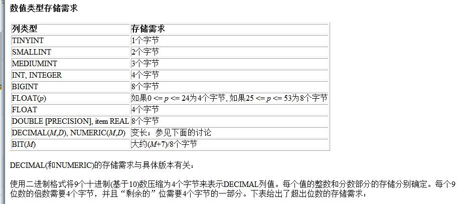
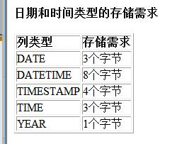
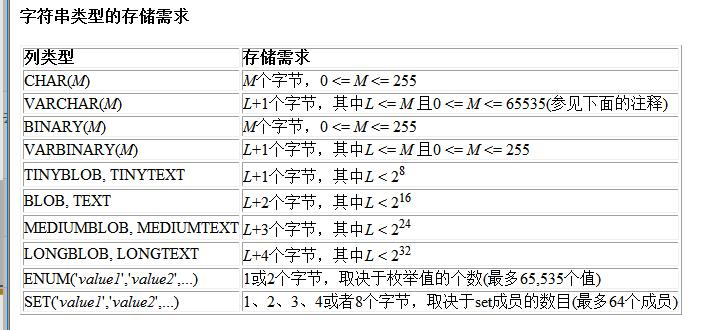

# mysql笔记  

## 一、连接与断开服务器

- **连接**服务器：  
`mysql -h host -u user -p [database]`  
其中host表示主机一般应为 `127.0.0.1` 表示本地主机，user表示用户一般为 `root`，例 `mysql -h 127.0.0.1 -u root -p`  
`-h host` 可以省略即 `mysql -u user -p`  
- **退出**服务器  
`mysql> quit`  

---

## 二、数据库管理

---

## 三、列类型  

### 1、数值类型

- 整数和浮点、定点类型都有一个可选属性 `UNSIGNED` （unsigned）指示为无符号类型，然而对于浮点和定点类型列值的上范围保持不变  
- 结合可选属性 `ZEROFILL`（补零）时，默认补充的空格用零代替。如，声明INT(5) ZEROFILL。如果为一个数值类型指定ZEROFILL时，MySQL自动为其添加UNSIGNED属性

#### 整型

类型|小写|字节|最小值|最大值
-|-|-|-|-
TINYINT|tinyint|1|-128|127
||||0|255
SMALLINT|smallint|2|-32768|32767|
||||0|65535
MEDIUMINT|mediumint|3|-8388608|8388607
||||0|16777215
INT|int|4|-2147483648|2147483647
||||0|4294967295
BIGINT|bigint|8|-9223372036854775808|9223372036854775807|
||||0|18446744073709551615

- 可以在类型关键字后面的括号内指定整数值显示的宽度（如，INT(4)）宽度小于指定列宽的值时从左侧填满宽度，显示宽度不限制可以在列内保存的值的范围，也不限制超多指定宽度的值的显示  

#### 浮点和定点

`FLOAT` 为单精度近似值，使用4个字节，`DOUBLE` 为双精度近似值，使用8个字节，DECIMAL和NUMERIC在MySQL中为同义词，用于保存确切精度的值如货币数据，DECIMAL(5,2)  

- 非标准语法：`FLOAT(M,D)` 或 `REAL(M,D)` 或 `DOUBLE PRECISION(M,D)`,M为整数位，D为小数位  
- MySQL将DOUBLE视为DOUBLE PRECISION(非标准扩展)的同义词，REAL视为DOUBLE PRECISION(非标准扩展)的同义词

#### BIT(M)  

`BIT(M)` 类型保存M位值，M的范围为1到64，自定位值用 `b'value'` 如b'111'。  

### 2、日期和时间类型

MySQL保存的日期允许出现零，如'1999-00-00'，若不想在日期中出现零，可以使用NO_ZERO_IN_DATE SQL模式  
MySQL允许'0000-00-00'保存为伪日期'，比NULL值更方便且数据和索引占用空间更小  
***零值模式***  
列类型|“零”值
-|-
DATETIME|'0000-00-00 00:00:00'
DATE|'0000-00-00'
TIMESTAMP|'00000000000000'
TIME|'00:00:00'
YEAR|0000

#### DATETIME、DATE和TIMESTAMP类型  

- DATETIME支持的范围 '1000-01-01 00:00:00' 到 '9999-12-31 23:59:59'  
- DATE支持的范围 '1000-01-01' 到 '9999-12-31'  
- TIMESTAMP类型的属性不固定  
- 'YYYY-MM-DD HH:MM:SS' 或 'YY-MM-DD HH:MM:SS' 允许不严格语法，任何标点符号都可做日起部分或者时间部分之间的间隔符。如'98@12@31 11^30^45'  

#### TIME类型  

'HH:MM:SS' 表示TIME值，可以从 '-838:59:59' 到 '838:59:59' ，因为TIME可以表示某个时间过去的时间或两个实践之间的时间间隔  

#### YEAR类型  

YYYY表示YEAR类型，是一个单字节类型，范围1901到2155，可以指示各种格式的YEAR值：
4位字符串，'1901'到'2155'，4位数字，1901到2155  
2位字符串，'00'到'99'，'00'到'69'转换为2000到2069，'70'到'99'转换为1970到1999  
2位整数，1到99，1到69转换为2001到2069,70到99转换为1970到1999  

### 3、String类型  

字符串类型CHAR、VARCHAR、BINARY、VARBINARY、BLOB、TEXT、ENUM和SET  

#### CHAR和VARCHAR类型  

- CHAR列的长度固定为创建表时声明的长度，为0-255的任何值，保存CHAR值时，右边填充空格以达到指定长度。检索到CHAR值时，尾部的空格被删掉  
- VARCHAR列的值为可变长字符串，为0-65535  

#### BINARY和VARBINARY

- BINARY和VARBINARY类似于CHAR和VARCHAR，他们包含的二进制字符串，也就是包含字节字符串  
- BINARY和CHAR性质类似，允许的最大长度相同，VARBINARY和VARCHAR性质类似，允许的最大长度相同  
- 保存BINARY值时，右边填充0x00（零字节），*选择时不删除尾部字节*  

#### BLOB和TEXT  

- BOLB是一个二进制大对象，可以容纳可变数量的数据。有4种BLOB类型：TINYBLOB、BLOB、MEDIUMBLOB、LONGBLOB，它们只是可容纳的最大长度不同。
- TEXT有4中类型：TINYTEXT、TEXT、MEDIUMTEXT、LONGTEXT对应BOLB4中类型  

#### ENUM类型

ENUM是一个字符串对象，其值来自表创建时在列中显式枚举的一列值，*每个枚举值有一个索引*  
如ENUM的列('one','two','three')，其索引
值|索引
-|-
NULL|NULL
''|0
'one'|1
'two'|2
'three'|3

#### SET类型  

SET是一个字符串对象，有零个或多个值，其值来自表创建时规定的允许的一列值，SET各成员以 `,` 隔开，SET成员本身不能包括逗号  
如，`SET('one','two')  NOT NULL`可以有 ''、'one'、'two'、'one,two'  
创建表时SET成员尾部的空格将*自动删除*  

  



---

## 四、mysql语句  

- 每一个语句后加 `;` 表示结束语句  
- 要取消语句加 `\c`  

***提示符状态***  

提示符|含义
------|----
->  |等待多行命令的下一行
'>  |等待下一行，等待以单引号 `'`开始的字符串的结束
">  |等待下一行，等待以双引号 `"`开始的字符串的结束
/*> |等待下一行，等待以/*开始的注释的结束  

- 显示时间 `SHOW NOW();` 或 `SHOW CURRENT_DATE;`

### 1、创建并选择数据库  

- 显示数据库列表  
`SHOW DATABASES`  
- 创建数据库  
`CREATE DATABASE <database>;`  
- 进入数据库  
`USE <database>`  
- 获取当前选择的数据库  
`SELECT DATABASE();`  

### 2、删除数据库  

- DROP命令  
`DROP DATABASE <database>`  
- 使用终端删除  
`[root@host]# mysqladmin -u root -p drop <database>`  

### 3、创建表
  
- 显示当前数据库的表  
`SHOW TABLES;`  
- 创建表  
`CREATE TABLE <table> (表项及说明);`  
- 显示表的创建信息  
`DESCRIBE <table>`  

### 4、删除表  

- DROP命令  
`DROP TABLE <table>`  

### 5、插入数据  

使用 `LOAD DATA` 或 `INSERT` 语句  

- 可以创建一个文本文件 `data.txt` ，每行包含一个记录，用定位符（tab）把值分开，并且以CREAE TABLE语句中列出的列次序给出，对于NULL值，在文本文件中写 `\N`:  
`LODA DATA LOCAL INFILE 'path/data.txt' INTO TABLE <table> LINES TERMINATED BY '\r\n';`  
- 若要增加一个或几个记录，可以使用INSERT语句，列次序与CREATE TABLE语句列出的列次序相同：  
`INSERT INTO <table> [(字段列表)] VALUES (记录1),(记录2),...;`  
 若无字段列表，则每个字段都需要有对应的记录；若有字段列表，则只记录列表只需要对应字段列表

### 6、更新记录UPDATE  

- 修改数据表数据  
`UPDATE <table> SET col_1=valu1,... [WHERE ...]`  

### 7、删除记录DELETE  

- 删除表中所有记录：  
`TRUNCATE TABLE <table>`  
- 选择删除记录  
`DELETE FROM <table> [WHERE ...]`  

### 8、查询  

***通用查询格式***  

``` sql
SELECT col_list
FROM table_list
[WHERE 条件]
[LIMIT N][ OFFSET M]
```  

- 查询语句中你可以使用一个或者多个表，表之间使用逗号(,)分割，并使用WHERE语句来设定查询条件。
- SELECT 命令可以读取一条或者多条记录。  
- 你可以使用星号（*）来代替其他字段，SELECT语句会返回表的所有字段数据
- 你可以使用 `WHERE` 语句来包含任何条件。
- 你可以使用 `LIMIT` 属性来设定返回的记录数。
- 你可以通过`OFFSET`指定`SELECT`语句开始查询的数据偏移量。默认情况下偏移量为0。

#### 1）WHERE子句  

`SELECT col_list FROM table_list [WHERE 条件1 [AND [OR]] 条件2...]`  

- 查询语句中你可以使用一个或者多个表，表之间使用逗号, 分割，并使用WHERE语句来设定查询条件。
- 你可以在 WHERE 子句中指定任何条件。
- 你可以使用 AND 或者 OR 指定一个或多个条件。
- WHERE 子句也可以运用于 SQL 的 `DELETE` 或者 `UPDATE` 命令。
- WHERE 子句类似于程序语言中的 if 条件，根据 MySQL 表中的字段值来读取指定的数据。

***可用于WHERE语句的操作符列表***

操作符|描述
:-:|-|-
=       |等号，检测两个值是否相等，如果相等返回true|
<>,!=   |不等于，检测两个值是否相等，如果不相等返回true|
|>      |大于号，如果左边的值大于右边的值返回true|
|<      |小于号，如果左边的值小于右边的值返回true|
|>=     |如果左边的值大于等于右边的值返回true|
|<=     |如果左边的值小于等于右边的值返回true|

#### 2）DISTINCT语句

在表中，一个列会包含多个重复值，若要仅仅列出不同的值，DISTINCT关键字用于返回唯一不同的值  
`SELECT DISTINCT col_list FROM <table>`  

#### 3）LIKE子句  

LIKE用于在WHERE搜索列的指定模式，`%`表示任意和任意数量字符，`_`代替一个字符，  
例如  
`SELECT col_list FROM <table> WHERE col='G%'`  

#### 4）正则REGEXP

使用`REGEXP`或`NOT REGEXP`运算符，（或RLIKE和NOT RLIKE）`[char_list]`表示字符列中任何单一字符，`[^char_list]`或`[!char_list]`，`^`可以在首或尾，表示以某字符开始或某字符结尾  
`SELECT col_list FROM <table> WHERE col REGEXP '表达式'`  

#### 5）UNION操作符  

MySQL UNION 操作符用于连接两个以上的 SELECT 语句的结果组合到一个结果集合中。多个 SELECT 语句会默认删除重复的数据，可以加ALL保留重复数据。  

```sql
SELECT col_list FROM table_list [WHERE]
UNION [ ALL|DISTINCT ]
SELECT col_list FROM table_list
```

#### 6）连接JOIN

- `JOIN`或`INNER JOIN`（内连接或等值连接）：获取两个表中字段匹配关系的记录
- `LEFT JOIN`（左连接）：获取左表所有记录，即使右表没有对应匹配的记录。
- `RIGHT JOIN`（右连接）：与 LEFT JOIN 相反，用于获取右表所有记录，即使左表没有对应匹配的记录。  
例句：  
`SELECT a.col1,a.col2,b.col1 FROM tb1 a INNER JOIN tb2 b ON condition`

#### 4）排序ORDER BY  

`SELECT * FROM <tabel> ORDER BY col_list [ASC|DESC] [LIMIT]` 默认为ASC升序排列，DESC为降序排列

#### 5）分组GROUP

格式：  
`SELECT col, function(col_name) FROM <table> [WHERE] GROUP BY col [WITH ROOLLUP]`  
WITH ROLLUP 可以实现在分组统计数据基础上再进行相同的统计（SUM,AVG,COUNT…）。在添加其后，可以使用 coalesce 来设置一个可以取代 NUll 的名称，coalesce 语法：`coalesec(a,b,c)`。参数说明：如果a==null,则选择b；如果b==null,则选择c；如果a!=null,则选择a；如果a b c 都为null ，则返回为null（没意义）。

#### 7）更新表结构ALTER  

- **添加字段**  
`ALTER TABLE <table> ADD col 描述`  
- **删除字段**  
`ALTER TABLE <table> DROP [COL_NAME] col`  
- **修改字段**，使用`MODIFY`或`CHANGE`，二者不同  
对于MODIFY不改变名字，只是更改它的某个属性  
`ALTER TABLE <table> MODIFY col 类型`  
对于CHANGE可以改变名字，并必须指定新类型  
`ALTER TABLE <table> CHANGE old_col new_col 完整描述`  
- ALTER命令

> 修改表名：  
> `ALTER TABLE <table> RENAME TO <new_table_name>`  
> 修改字段默认值：  
> `ALTER TABLE <table> ALTER col SET DEFAULT 值`  
> 删除字段默认值：  
> `ALTER TABLE <table> ALTER col DROP DEFAULT`
> 修改表类型：  
> `ALTER TABLE <table> ENGINE=...`  

### 9、约束  

约束|作用
-|-
NOT NULL    |   非空
UNIQUE      |   保证每行有唯一的值
PRIMARY KEY |   主键约束NOT NULL和UNIQUE的结合，确保某列（或多列的结合）有唯一标识
FOREIGN KEY |   外键约束，保证一个表的数据匹配另一个表的值的参照完整性
CHECK       |   保证列中的值符合指定条件
DEFAULT     |   规定没有给列赋值时的默认值

在创建表时，`NOT NULL`，`UNIQUE`，`PRIMARY KEY`，`CHECK`，`REFERENCES <foreign_table>(f_col)`可以写在列描述的后面，或者另起一行如：  
`UNIQUE (col), FOREIGN KEY (col) REFERENCES <foreign_table>(f_col), CHECK(col>0)`  

自动增长`AUTO_INCREMENT`  

### 10、索引  

创建索引时，你需要确保该索引是应用在 SQL 查询语句的条件(一般作为 WHERE 子句的条件)。
实际上，索引也是一张表，该表保存了主键与索引字段，并指向实体表的记录。  

- 可以在创建表时直接指定  
`INDEX [index_name] (col(length))`  
`UNIQUE [index_name] (col(length))`  
- 创建添加索引，`UNIQUE`为唯一索引  
`CREATE [UNIQUE] INDEX index_name ON <table>(col(length))`  
`ALTER TABLE <table> ADD INDEX index_name(col)`  
`ALTER TABLE <table> ADD UNIQUE [index_name] (col(length))`  

- 使用ALTER 命令添加和删除索引，有四种方式来添加数据表的索引：

> `ALTER TABLE tbl_name ADD PRIMARY KEY (column_list)`: 该语句添加一个主键，这意味着索引值必须是唯一的，且不能为NULL。  
`ALTER TABLE tbl_name ADD UNIQUE index_name (column_list)`: 这条语句创建索引的值必须是唯一的（除了NULL外，NULL可能会出现多次）。  
`ALTER TABLE tbl_name ADD INDEX index_name (column_list)`: 添加普通索引，索引值可出现多次。  
`ALTER TABLE tbl_name ADD FULLTEXT index_name (column_list)`:该语句指定了索引为 FULLTEXT ，用于全文索引。
>

- 删除索引  
`ALTER TABLE <table> DROP INDEX c;`  
